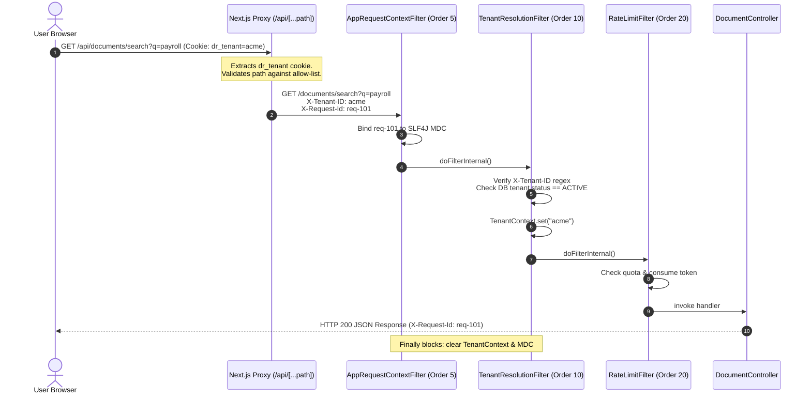
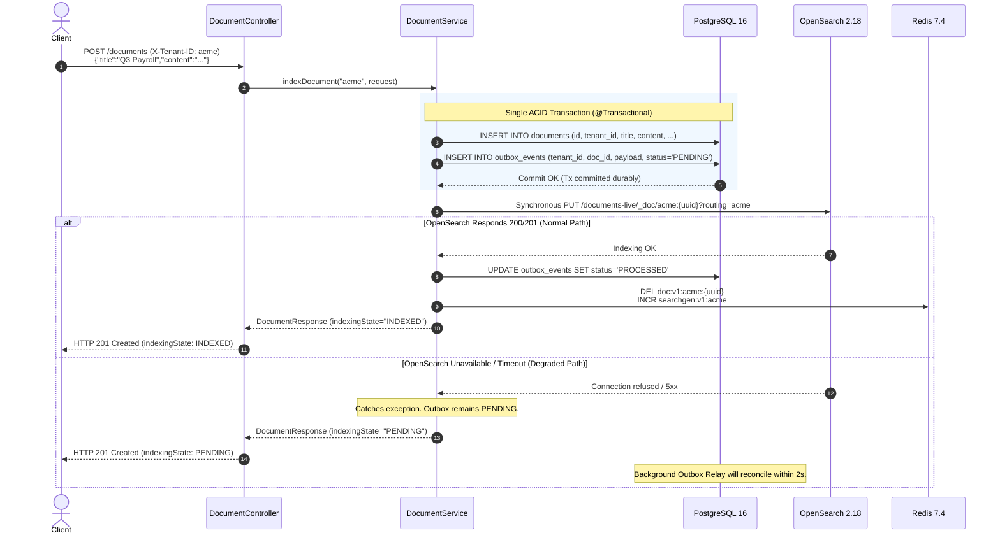
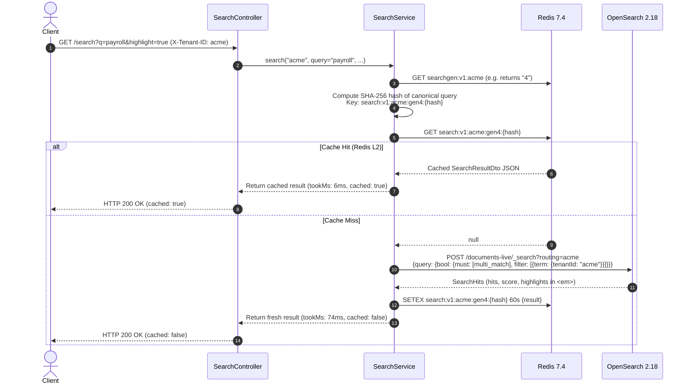
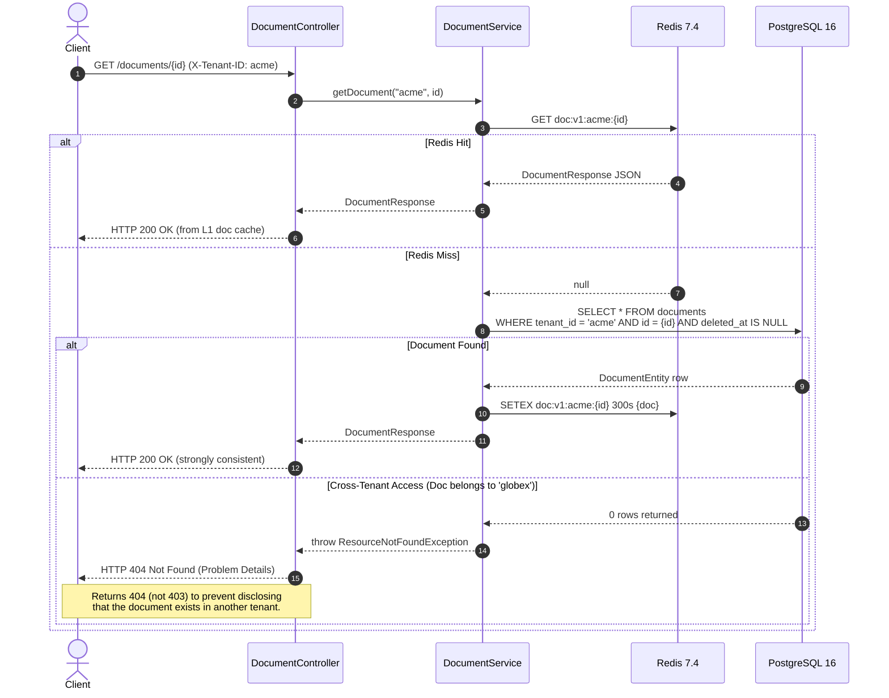
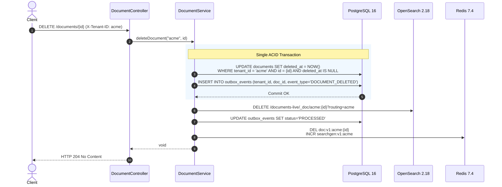
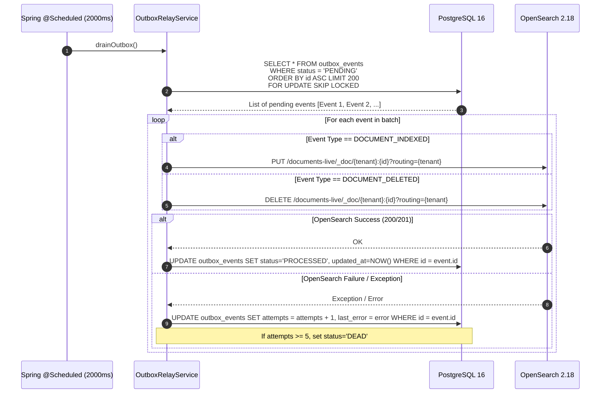
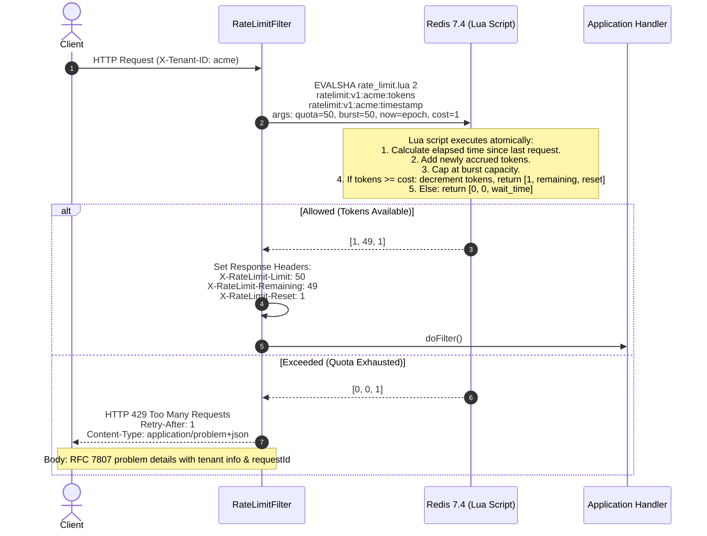
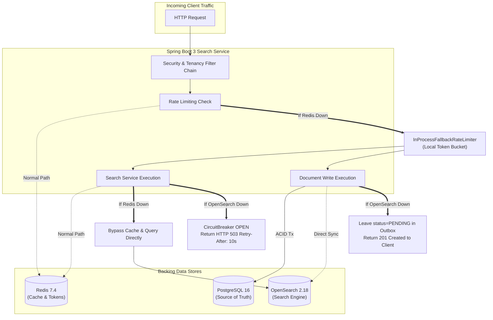

# Master Architecture & User Flows Review Document

> **Project**: Distributed Multi-Tenant Document Search Service  
> **Engineering Scope**: 10M+ documents capacity, sub-500ms p95 search latency, 1,000+ queries/second, strict multi-tenant data isolation.

---

## 1. Executive Architecture Summary

The **Distributed Document Search Service** is an enterprise-grade, multi-tenant document management and full-text retrieval system. It is engineered with a strict separation between **strongly consistent transactional operations** (the source of truth) and **horizontally scalable derived search indices** (the read path).

```
                          ┌──────────────────────────┐
                          │   Browser (Next.js 15)   │
                          └────────────┬─────────────┘
                           same-origin │ httpOnly cookie: dr_tenant
                                       ▼
                          ┌──────────────────────────┐
                          │  Next.js Route Handler   │
                          │  /api/[...path] proxy    │
                          │  injects X-Tenant-ID     │
                          └────────────┬─────────────┘
                                       │  X-Tenant-ID: acme
    ┌──────────────────────────────────▼───────────────────────────────────┐
    │              API Gateway / Ingress (Production)                      │
    │        TLS Termination · WAF · Global Rate Limit · JWT Auth          │
    └───────┬──────────────────────┬───────────────────────┬───────────────┘
            ▼                      ▼                       ▼
      ┌───────────┐          ┌───────────┐           ┌───────────┐
      │   api-1   │          │   api-2   │           │   api-N   │   Stateless,
      │ Spring    │          │           │           │           │   Horizontally
      │ Boot 3    │          │           │           │           │   Scalable
      └─────┬─────┘          └─────┬─────┘           └─────┬─────┘
            │  Per-request filter chain (Security & Tenancy Boundary)
            │    5  AppRequestContextFilter   requestId → MDC + X-Request-Id header
            │   10  TenantResolutionFilter   validate tenant & status — FAILS CLOSED
            │   20  RateLimitFilter          atomic Lua token bucket — FAILS OPEN
            └──────────┬───────────────┬──────────────────┬──────────────┐
                       ▼               ▼                  ▼              ▼
               ┌──────────────┐ ┌──────────────┐  ┌──────────────┐ ┌──────────────┐
               │ PostgreSQL 16│ │ OpenSearch   │  │   Redis 7.4  │ │ Outbox Relay │
               │              │ │    2.18      │  │              │ │ @Scheduled,  │
               │ SOURCE OF    │ │ derived,     │  │ search cache │ │ SKIP LOCKED  │
               │ TRUTH        │ │ rebuildable  │  │ doc cache    │ │              │
               │ documents    │ │ BM25 + high- │  │ token buckets│ │ ─► Phase 2:  │
               │ tenants      │ │ light        │  │ LRU, 256MB   │ │ Kafka topic  │
               │ outbox_events│ │ routing=     │  │ non-durable  │ │ doc.index.v1 │
               │              │ │ tenantId     │  │ by design    │ │ keyed by     │
               │              │ │              │  │              │ │ tenantId     │
               └──────────────┘ └──────────────┘  └──────────────┘ └──────────────┘
                    FATAL            FATAL          NON-FATAL
                                                 (degrades, stays in LB)
```

### Architectural Asymmetry: Fail-Closed vs. Fail-Open

The system enforces a fundamental architectural asymmetry between security and performance:

| Dimension | Policy | Behavior on Failure | Rationale |
| :--- | :--- | :--- | :--- |
| **Tenant Isolation & Security** | **FAIL CLOSED** | Immediate `HTTP 400` (missing) or `HTTP 403` (unauthorized/mismatched). Cross-tenant read returns `HTTP 404`. | Cross-tenant data leakage is a catastrophic, unrecoverable security breach. A request is never allowed to proceed without a verified tenant boundary. |
| **Caching & Rate Limiting (Redis)** | **FAIL OPEN** | Falls back to in-process token buckets; search queries bypass cache and query OpenSearch directly. | Redis is an optimization, not a source of truth. If Redis nodes fail, the system degrades performance gracefully without taking the service down. |
| **Search Cluster (OpenSearch)** | **ASYMMETRIC** | **Write Path**: `HTTP 201 Created` (doc committed to Postgres, outbox event `PENDING`).<br>**Read Path**: Circuit breaker opens, returns `HTTP 503`. | Ingestion never fails when OpenSearch is degraded; background outbox reconciliation guarantees eventual consistency. |

---

## 2. Technology Stack & Architectural Decisions

The stack was chosen based on specific scale, latency, and isolation requirements (detailed in ADRs 1 through 6):

| Component | Selected Technology | Role | Key Architectural Trade-off |
| :--- | :--- | :--- | :--- |
| **Backend Framework** | **Java 21 / Spring Boot 3.3.5** | Core Business API & Outbox Relay | Uses Java 21 **Virtual Threads** (`spring.threads.virtual.enabled=true`) for high-concurrency non-blocking I/O without reactive complexity. |
| **Source of Truth** | **PostgreSQL 16** | ACID Documents & Transactional Outbox | Guarantees atomic document creation and outbox event logging in a single ACID transaction. Eliminates dual-write split-brain risk ([ADR-0002](adr/adr2.md)). |
| **Full-Text Retrieval** | **OpenSearch 2.18** | Derived Inverted Index & BM25 Scoring | Shard routing via `routing=tenantId` directs queries to **1 shard instead of N**. Sub-100ms relevance retrieval with highlighting ([ADR-0001](adr/adr1.md), [ADR-0003](adr/adr3.md)). |
| **Cache & Rate Limiting** | **Redis 7.4** | L2 Query Cache & Lua Token Buckets | Atomic Lua token buckets prevent race conditions under load. $O(1)$ search cache invalidation via generation counters ([ADR-0004](adr/adr4.md)). |
| **Front-End Proxy** | **Next.js 15 (App Router)** | Client UI & Security Boundary | Route-handler proxy (`/api/[...path]`) injects tenant ID from `httpOnly` cookie; browser JavaScript never holds authorization credentials ([ADR-0006](adr/adr6.md)). |

---

## 3. The 4-Layer Multi-Tenancy Isolation Model

Multi-tenancy isolation is not treated as an application-level query convention; it is enforced across **four redundant defensive layers**:

```
Layer 1: Per-Request Web Filter
   │  Rejects missing, malformed, or mismatched X-Tenant-ID headers before controllers run
   ▼
Layer 2: ArchUnit Compile-Time Boundary
   │  Build fails if any code calls un-tenanted repository methods (e.g. findById)
   ▼
Layer 3: Mandatory Query Factory Filter Injection
   │  OpenSearchQueryFactory strictly injects { term: { tenantId } } into all queries
   ▼
Layer 4: Shard Routing & Composite Storage Key
      OpenSearch routing=tenantId and doc ID {tenantId}:{uuid} guarantees single-shard confinement
```

1. **Layer 1 — Per-Request Security Gate ([`TenantResolutionFilter`](file:///Users/rishabhjm/Projects/deeprunner-assignment/backend/src/main/java/com/deeprunner/docsearch/web/filter/TenantResolutionFilter.java))**:
   - Runs at `Order(HIGHEST_PRECEDENCE + 10)`.
   - Rejects missing headers (`400 MISSING_TENANT`) or regex-invalid IDs (`400 MALFORMED_TENANT`).
   - Detects parameter tampering: if `?tenant=globex` is requested with `X-Tenant-ID: acme`, it rejects with `403 TENANT_MISMATCH`.
   - Unknown or inactive tenants receive an identical `403 TENANT_ACCESS_DENIED` to prevent user enumeration attacks.
   - Binds tenant context to thread-local [`TenantContext`](file:///Users/rishabhjm/Projects/deeprunner-assignment/backend/src/main/java/com/deeprunner/docsearch/context/TenantContext.java).
2. **Layer 2 — Static Architectural Rules ([`ArchitectureTest`](file:///Users/rishabhjm/Projects/deeprunner-assignment/backend/src/test/java/com/deeprunner/docsearch/architecture/ArchitectureTest.java))**:
   - Uses ArchUnit to inspect compiled bytecode.
   - Rule `noUntenantedFindById`: Fails the build if any service or controller invokes `DocumentRepository.findById(Object)`. Callers must use `findByTenantIdAndIdAndDeletedAtIsNull(String, UUID)`.
   - Rule `controllersShouldNotDependOnRepositories`: Controllers must delegate through services and cannot bypass business logic.
3. **Layer 3 — Query Factory Filter Injection ([`OpenSearchQueryFactory`](file:///Users/rishabhjm/Projects/deeprunner-assignment/backend/src/main/java/com/deeprunner/docsearch/search/OpenSearchQueryFactory.java))**:
   - The query factory throws `IllegalArgumentException` if `tenantId` is null or blank.
   - Automatically injects a non-scoring filter clause: `filter: [{ term: { tenantId: "acme" } }]`. Even if an end user inputs Lucene syntax wildcards (`*.*`), OpenSearch's filter context restricts the candidate pool strictly to that tenant.
4. **Layer 4 — Composite Identifier & Shard Routing ([`OpenSearchAdapter`](file:///Users/rishabhjm/Projects/deeprunner-assignment/backend/src/main/java/com/deeprunner/docsearch/search/OpenSearchAdapter.java))**:
   - Documents are stored under `id: "{tenantId}:{docUuid}"`.
   - All search, index, and delete operations pass `?routing={tenantId}`.
   - All documents for a tenant reside on **one primary shard and its replicas**, preventing scatter-gather overhead across the cluster.

---

## 4. End-to-End User & System Flows

### Flow 1: Web UI Session & Tenant Propagation

This flow demonstrates how user interactions in the browser securely propagate the tenant boundary down to the datastore without exposing tenant credentials to client-side scripts.



1. **Browser**: Calls Next.js proxy route `GET /api/search?q=payroll` with same-origin `httpOnly` cookie `dr_tenant=acme`.
2. **Next.js Route Proxy**: Reads cookie, verifies path against allow-list, generates `X-Request-Id` if absent, and injects header `X-Tenant-ID: acme` to the backend.
3. **`AppRequestContextFilter`**: Binds `requestId` to SLF4J MDC and sets `X-Request-Id` on HTTP response.
4. **`TenantResolutionFilter`**: Validates tenant exists and is `ACTIVE`. Stores tenant in `TenantContext` (thread-local).
5. **`RateLimitFilter`**: Checks tenant token bucket.
6. **Controller**: Safely reads `TenantContext.requireTenantId()`.

---

### Flow 2: Ingesting / Indexing a Document (ACID Outbox Write Path)

Demonstrates zero-data-loss document ingestion using the Transactional Outbox pattern.



**Key Code Call Path**:
- `DocumentController.indexDocument` -> `DocumentService.indexDocument`
- Inside `createDocumentInTx`:
  ```java
  DocumentEntity saved = documentRepository.save(entity);
  OutboxEventEntity outboxEvent = new OutboxEventEntity(tenantId, docId, EVENT_INDEX, payloadJson);
  outboxEventRepository.save(outboxEvent);
  ```
- If direct OpenSearch write succeeds:
  - `markOutboxProcessed(outboxId)`
  - `redisTemplate.delete(CacheKeys.documentKey(tenantId, docId))`
  - `redisTemplate.opsForValue().increment(CacheKeys.searchGenKey(tenantId))` (invalidates tenant search cache in $O(1)$).

---

### Flow 3: Executing a Search (Origin vs. L2 Cache Hit)

Demonstrates relevance scoring with BM25, snippet highlighting, and generation-based caching.



**Generation Counter Invalidation Formula**:
- A search cache key includes the tenant's current generation: `search:v1:{tenant}:{generation}:{querySha256}`.
- When any document is written or deleted for `acme`, the system executes:
  ```redis
  INCR searchgen:v1:acme
  ```
- Old search keys (e.g., `gen:3`) become instantly unreachable and are cleaned up via TTL (60s), achieving **$O(1)$ cache invalidation without expensive keyspace scanning**.

---

### Flow 4: Strongly Consistent Read-Your-Writes (`GET /documents/{id}`)

Demonstrates reading directly from the source of truth with strict tenant isolation.



---

### Flow 5: Soft-Deleting a Document & Index Purge

Demonstrates auditability preservation and search index cleanup.



---

### Flow 6: Background Outbox Relay Reconciliation (Self-Healing)

Demonstrates how asynchronous background tasks guarantee eventual consistency even if OpenSearch was temporarily offline during write operations.



**Thread Safety & Horizontal Scale**:
- `FOR UPDATE SKIP LOCKED` allows **multiple application instances** to poll the outbox simultaneously without lock contention or duplicate processing.
- A partial index on PostgreSQL:
  ```sql
  CREATE INDEX idx_outbox_pending_id ON outbox_events (status, id) WHERE status = 'PENDING';
  ```
  ensures sub-millisecond query execution regardless of how many millions of historical records exist in `outbox_events`.
- Autovacuum tuning (`autovacuum_vacuum_scale_factor = 0.01`) prevents bloat from high churn.

---

### Flow 7: Per-Tenant Token-Bucket Rate Limiting (Redis Lua)

Demonstrates atomic per-tenant quota enforcement and noisy-neighbor isolation.



---

### Flow 8: Graceful Degradation & Failure Topologies

Demonstrates how each dependency failure is isolated to prevent cascading outages:



---

## 5. Data Models & Storage Schema Reference

### 5.1 PostgreSQL 16 (Relational Source of Truth)

```sql
-- 1. Tenants table: Configures isolation, status, and quotas
CREATE TABLE tenants (
    id VARCHAR(64) PRIMARY KEY,
    name VARCHAR(256) NOT NULL,
    tier VARCHAR(32) NOT NULL DEFAULT 'STANDARD',
    rate_limit_per_second INT NOT NULL DEFAULT 50,
    status VARCHAR(32) NOT NULL DEFAULT 'ACTIVE',
    created_at TIMESTAMPTZ NOT NULL DEFAULT CURRENT_TIMESTAMP,
    updated_at TIMESTAMPTZ NOT NULL DEFAULT CURRENT_TIMESTAMP
);

-- 2. Documents table: Tenant-partitioned source of truth with soft-deletion
CREATE TABLE documents (
    id UUID PRIMARY KEY,
    tenant_id VARCHAR(64) NOT NULL REFERENCES tenants(id),
    external_id VARCHAR(256),
    title VARCHAR(512) NOT NULL,
    content TEXT NOT NULL,
    author VARCHAR(256),
    tags TEXT[],
    content_type VARCHAR(64) NOT NULL DEFAULT 'text/plain',
    version BIGINT NOT NULL DEFAULT 0,
    created_at TIMESTAMPTZ NOT NULL DEFAULT CURRENT_TIMESTAMP,
    updated_at TIMESTAMPTZ NOT NULL DEFAULT CURRENT_TIMESTAMP,
    deleted_at TIMESTAMPTZ
);
CREATE INDEX idx_documents_tenant_created ON documents (tenant_id, created_at DESC) WHERE deleted_at IS NULL;
CREATE INDEX idx_documents_tenant_external_id ON documents (tenant_id, external_id) WHERE deleted_at IS NULL;

-- 3. Outbox table: Guarantees reliable asynchronous delivery to OpenSearch
CREATE TABLE outbox_events (
    id BIGSERIAL PRIMARY KEY,
    tenant_id VARCHAR(64) NOT NULL,
    document_id UUID NOT NULL,
    event_type VARCHAR(32) NOT NULL,
    payload JSONB NOT NULL,
    status VARCHAR(32) NOT NULL DEFAULT 'PENDING',
    attempts INT NOT NULL DEFAULT 0,
    last_error TEXT,
    created_at TIMESTAMPTZ NOT NULL DEFAULT CURRENT_TIMESTAMP,
    updated_at TIMESTAMPTZ NOT NULL DEFAULT CURRENT_TIMESTAMP
);
CREATE INDEX idx_outbox_pending_id ON outbox_events (status, id) WHERE status = 'PENDING';
ALTER TABLE outbox_events SET (autovacuum_vacuum_scale_factor = 0.01);
```

### 5.2 OpenSearch 2.18 (Derived Index Mappings)

Alias `documents-live` points to `documents-v1`:

```json
{
  "settings": {
    "index": {
      "number_of_shards": 3,
      "number_of_replicas": 0,
      "refresh_interval": "1s",
      "routing.allocation.total_shards_per_node": 3
    }
  },
  "mappings": {
    "_routing": { "required": true },
    "properties": {
      "id": { "type": "keyword" },
      "tenantId": { "type": "keyword" },
      "externalId": { "type": "keyword" },
      "title": {
        "type": "text",
        "analyzer": "standard",
        "fields": { "keyword": { "type": "keyword", "ignore_above": 256 } }
      },
      "content": { "type": "text", "analyzer": "standard" },
      "author": { "type": "keyword" },
      "tags": { "type": "keyword" },
      "contentType": { "type": "keyword" },
      "createdAt": { "type": "date" },
      "updatedAt": { "type": "date" }
    }
  }
}
```

### 5.3 Redis 7.4 Keyspace Structure

| Key Pattern | Data Type | TTL | Purpose |
| :--- | :--- | :--- | :--- |
| `ratelimit:v1:{tenant}:tokens` | Float / String | 2s | Current available tokens in tenant bucket. |
| `ratelimit:v1:{tenant}:ts` | Integer / String | 2s | Millisecond epoch timestamp of last bucket update. |
| `searchgen:v1:{tenant}` | Integer (String) | None | Generation counter for tenant search cache. Bumped on document write/delete. |
| `search:v1:{tenant}:{gen}:{queryHash}` | String (JSON) | 60s | Cached search result for query parameters under current generation. |
| `doc:v1:{tenant}:{docId}` | String (JSON) | 300s | Strongly consistent document lookup cache. |

---

## 6. Codebase Map & Key Components

All source code is cleanly separated across decoupled packages:

| Component / Layer | Key Classes & Links | Responsibility |
| :--- | :--- | :--- |
| **Security & Context Filters** | [`AppRequestContextFilter`](file:///Users/rishabhjm/Projects/deeprunner-assignment/backend/src/main/java/com/deeprunner/docsearch/context/AppRequestContextFilter.java)<br>[`TenantResolutionFilter`](file:///Users/rishabhjm/Projects/deeprunner-assignment/backend/src/main/java/com/deeprunner/docsearch/web/filter/TenantResolutionFilter.java)<br>[`RateLimitFilter`](file:///Users/rishabhjm/Projects/deeprunner-assignment/backend/src/main/java/com/deeprunner/docsearch/web/filter/RateLimitFilter.java)<br>[`TenantContext`](file:///Users/rishabhjm/Projects/deeprunner-assignment/backend/src/main/java/com/deeprunner/docsearch/context/TenantContext.java) | Request ID correlation (MDC), fail-closed tenant validation, per-tenant rate limit enforcement, thread-local context management. |
| **Controllers & Errors** | [`DocumentController`](file:///Users/rishabhjm/Projects/deeprunner-assignment/backend/src/main/java/com/deeprunner/docsearch/web/controller/DocumentController.java)<br>[`SearchController`](file:///Users/rishabhjm/Projects/deeprunner-assignment/backend/src/main/java/com/deeprunner/docsearch/web/controller/SearchController.java)<br>[`HealthController`](file:///Users/rishabhjm/Projects/deeprunner-assignment/backend/src/main/java/com/deeprunner/docsearch/web/controller/HealthController.java)<br>[`GlobalExceptionHandler`](file:///Users/rishabhjm/Projects/deeprunner-assignment/backend/src/main/java/com/deeprunner/docsearch/web/controller/GlobalExceptionHandler.java) | REST endpoints for indexing, search, diagnostics, and RFC 7807 problem details error mapping. |
| **Domain Services** | [`DocumentService`](file:///Users/rishabhjm/Projects/deeprunner-assignment/backend/src/main/java/com/deeprunner/docsearch/service/DocumentService.java)<br>[`SearchService`](file:///Users/rishabhjm/Projects/deeprunner-assignment/backend/src/main/java/com/deeprunner/docsearch/service/SearchService.java)<br>[`OutboxRelayService`](file:///Users/rishabhjm/Projects/deeprunner-assignment/backend/src/main/java/com/deeprunner/docsearch/service/OutboxRelayService.java)<br>[`DefaultTenantService`](file:///Users/rishabhjm/Projects/deeprunner-assignment/backend/src/main/java/com/deeprunner/docsearch/service/DefaultTenantService.java) | Transactional document writes, generation-counter cached search retrieval, background outbox draining, tenant lookup. |
| **Search Engine Engine** | [`OpenSearchAdapter`](file:///Users/rishabhjm/Projects/deeprunner-assignment/backend/src/main/java/com/deeprunner/docsearch/search/OpenSearchAdapter.java)<br>[`OpenSearchQueryFactory`](file:///Users/rishabhjm/Projects/deeprunner-assignment/backend/src/main/java/com/deeprunner/docsearch/search/OpenSearchQueryFactory.java)<br>[`OpenSearchConfig`](file:///Users/rishabhjm/Projects/deeprunner-assignment/backend/src/main/java/com/deeprunner/docsearch/search/OpenSearchConfig.java) | Index lifecycle initialization, shard routing injection, BM25 query construction, snippet highlighting. |
| **Rate Limiting Engine** | [`RedisRateLimiter`](file:///Users/rishabhjm/Projects/deeprunner-assignment/backend/src/main/java/com/deeprunner/docsearch/service/RedisRateLimiter.java)<br>[`InProcessFallbackRateLimiter`](file:///Users/rishabhjm/Projects/deeprunner-assignment/backend/src/main/java/com/deeprunner/docsearch/service/InProcessFallbackRateLimiter.java) | Distributed Lua token bucket execution with automatic local fallback when Redis is unreachable. |
| **Data Repositories** | [`DocumentRepository`](file:///Users/rishabhjm/Projects/deeprunner-assignment/backend/src/main/java/com/deeprunner/docsearch/repository/DocumentRepository.java)<br>[`OutboxEventRepository`](file:///Users/rishabhjm/Projects/deeprunner-assignment/backend/src/main/java/com/deeprunner/docsearch/repository/OutboxEventRepository.java)<br>[`TenantRepository`](file:///Users/rishabhjm/Projects/deeprunner-assignment/backend/src/main/java/com/deeprunner/docsearch/repository/TenantRepository.java) | Strictly tenanted Spring Data JPA interfaces; native query outbox polling (`SKIP LOCKED`). |
| **Front-End Next.js UI** | [`route.ts`](file:///Users/rishabhjm/Projects/deeprunner-assignment/frontend/src/app/api/%5B...path%5D/route.ts)<br>[`page.tsx`](file:///Users/rishabhjm/Projects/deeprunner-assignment/frontend/src/app/page.tsx)<br>[`SearchTab.tsx`](file:///Users/rishabhjm/Projects/deeprunner-assignment/frontend/src/components/SearchTab.tsx)<br>[`IndexTab.tsx`](file:///Users/rishabhjm/Projects/deeprunner-assignment/frontend/src/components/IndexTab.tsx)<br>[`HealthTab.tsx`](file:///Users/rishabhjm/Projects/deeprunner-assignment/frontend/src/components/HealthTab.tsx) | Secure proxy route handler, tenant switcher, BM25 search UI, document creation form, live dependency health dashboard. |

---

## 7. Performance & Sizing Calculations

### 7.1 Search Latency Budget (Target: Sub-500ms p95)
Under 1,000 QPS load across 10M documents:
- **Redis Cache Hit Path**:
  - Ingress + Next.js Proxy: ~2ms
  - Spring Filter Chain: <1ms
  - Redis L2 Generation & Cache Lookup: 2–4ms
  - JSON Serialization & Response: 1ms
  - **Total Latency (Cache Hit)**: **6–10 ms** (far exceeding SLA)
- **OpenSearch Origin Path (Cache Miss)**:
  - Shard Routing (`routing=tenantId`): Confines query to **1 shard** (no scatter-gather overhead).
  - OpenSearch BM25 Lucene inverted index evaluation: 35–80ms
  - Highlight snippet generation: 10–25ms
  - Redis cache population: 2ms
  - **Total Latency (Origin)**: **50–120 ms** (sub-500ms p95 guaranteed)

### 7.2 Storage Sizing (10M Documents)
- Average document: 5 KB text content + 500 B metadata = **5.5 KB / document**.
- **PostgreSQL**:
  - Raw table data: $10\text{M} \times 5.5\text{ KB} \approx 55\text{ GB}$.
  - B-tree indexes (`tenant_id, created_at`, `tenant_id, external_id`): ~12 GB.
  - Total Postgres storage: **~70 GB**.
- **OpenSearch**:
  - Inverted index + translog + source store: $10\text{M} \times 7\text{ KB} \approx 70\text{ GB}$.
  - With 1 replica: **140 GB storage**.
  - Shard count: 3 primary shards = ~23 GB / primary shard (within the recommended 20–50 GB Lucene shard sweet spot).

---

## 8. Verification & Operational Reference

| Purpose | Command | What It Validates |
| :--- | :--- | :--- |
| **All Automated Tests** | `cd backend && mvn test` | Runs 18 tests: ArchUnit rules, full context bootstrap (`DocSearchApplicationTest`), tenant cross-read 404s, query factory tenant filter injection, rate limiter replenishment. |
| **Live Smoke Verification** | `./scripts/verify.sh` | Tests live health, write outbox commit, read-your-writes, cross-tenant isolation 404, parameter conflict 403, and fail-closed missing tenant 400. |
| **Sample Data Seeding** | `./scripts/seed.sh` | Seeds sample corporate runbooks and engineering documents across tenants `acme`, `globex`, and `initech`. |
| **Rate Limit Bursting** | `./api/curl/requests.sh acme` | Sends burst requests to demonstrate token bucket depletion, `X-RateLimit-*` headers, and RFC 7807 `429 Too Many Requests`. |
| **Full Stack Startup** | `./scripts/up.sh -Mode full -Seed` | Starts all 5 Docker containers (PostgreSQL, OpenSearch, Redis, API, Next.js UI) and seeds initial documents. |
